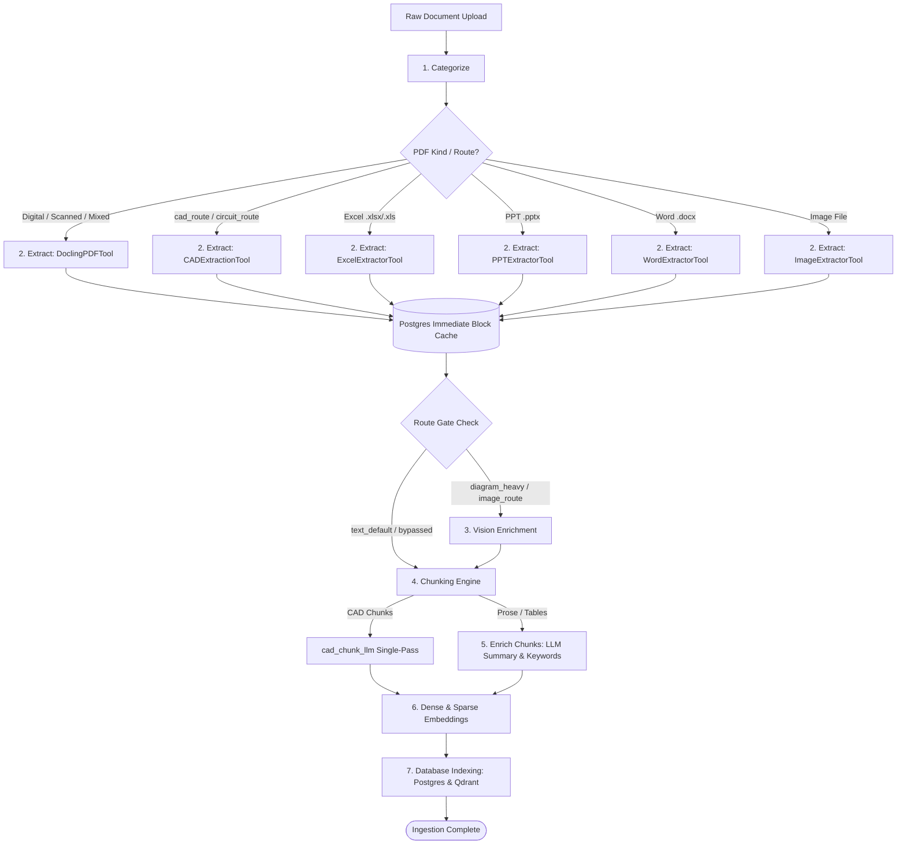
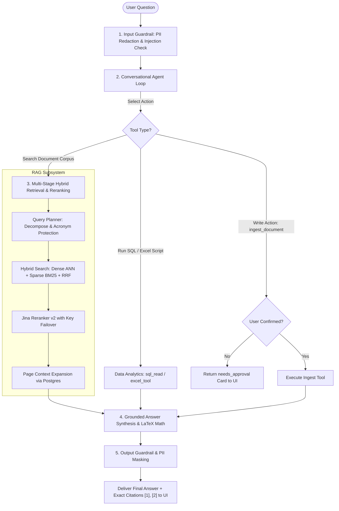
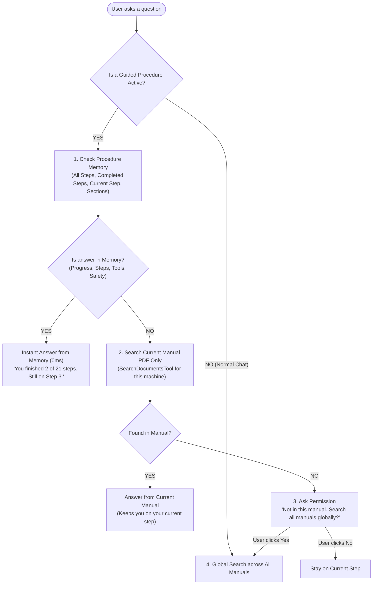

# AI-Accelerator: Enterprise Document Intelligence & Agentic RAG Platform

**AI-Accelerator** is a config-driven, production-grade Document Intelligence and Agentic Retrieval-Augmented Generation (RAG) platform. It transforms complex enterprise documents (PDFs, Excel workbooks, PowerPoint decks, Word documents, CAD mechanical drawings, circuit schematics, and high-resolution images) into structured, search-ready knowledge assets. It serves an autonomous conversational agent with exact page-level citations, 3-stage AI safety guardrails, multi-currency cost tracking, and resilient hybrid vector retrieval.

---

## 1. Architectural Invariants

The entire platform operates on three foundational engineering principles:

1. **Everything is a Single-Purpose Tool**: Every processing node implements the `Tool.run(state, config)` protocol ([`backend/core/tool.py`](file:///d:/AI-Acc-updated/AI-Accelerator/backend/core/tool.py)). Tools never call each other directly; they read required inputs from a shared typed dictionary (`PipelineState`) and return state mutations.
2. **Config-Driven Graph Assembly**: The pipeline is assembled dynamically from [`config/global.yaml`](file:///d:/AI-Acc-updated/AI-Accelerator/config/global.yaml) via **LangGraph**. Modifying step sequences, enabling route gates, or swapping model providers is achieved purely through configuration without touching Python source code.
3. **Decoupled Self-Hosted Data Plane**: Relational metadata, chat history, and immediate block caches reside in **PostgreSQL 16**; vector embeddings reside in **Qdrant** (dense + sparse BM25); object files and page crops are stored in local disk/Supabase Storage. LLMs and VLMs are swappable external APIs with backoff pacing and retry resilience.

---

## 2. Ingestion Pipeline Deep-Dive

The ingestion pipeline transforms raw input files into enriched, multi-vector database elements via a 7-stage directed acyclic graph (DAG):



### Ingestion Stage Specifications

| Stage | Tool & Module | Primary Engine | Execution Location | Input $\rightarrow$ Output Contract | Fault Tolerance & Limits |
|---|---|---|---|---|---|
| **1. Categorize** | `CategorizeTool`<br>([`categorize/`](file:///d:/AI-Acc-updated/AI-Accelerator/backend/categorize/)) | PyMuPDF + Multimodal VLM (Gemini / Llama 3.2 Vision / GPT-4o) | External API + In-Process | File bytes $\rightarrow$ `{doc_type, industry, route, pdf_kind, confidence}` | Grounding verification check (`_evidence_supported`). Falls back to `text_default` if ungrounded. |
| **2. Extract** | `DoclingPDFTool`<br>`CADExtractionTool`<br>`ExcelExtractorTool`<br>`PPTExtractorTool`<br>`WordExtractorTool` | IBM Docling, TableFormer, OpenPyXL, python-pptx, python-docx | In-Process + VLM Rescue | Document File $\rightarrow$ `NormalizedBlock[]` (`text`, `heading`, `table`, `image_caption`) | Immediate PostgreSQL block caching (`pg.write_blocks`). Extractor errors append to `state["errors"]` without aborting. |
| **3. Vision Enrichment** | `VisionEnrichmentTool`<br>([`vision/`](file:///d:/AI-Acc-updated/AI-Accelerator/backend/vision/)) | Multimodal Vision (NVIDIA NIM / Gemini) | External API | `pending_vision` blocks $\rightarrow$ `image_caption` blocks | Route-gated (`diagram_heavy`, `image_route`). Perceptual image hashing skips re-captioning duplicates. |
| **4. Chunk** | `ChunkTool`<br>([`chunking/`](file:///d:/AI-Acc-updated/AI-Accelerator/backend/chunking/)) | Sliding Token Window / Chonkie Semantic | In-Process (CPU) | `NormalizedBlock[]` $\rightarrow$ `Chunk[]` (`size=400`, `overlap=50`) | Tables & images are atomic. Multi-row table splitting preserves headers. Dot-leader regex collapses $O(N^2)$ memory spikes. |
| **5. Enrich Chunks** | `EnrichChunksTool`<br>([`enrichment/`](file:///d:/AI-Acc-updated/AI-Accelerator/backend/enrichment/)) | OpenAI GPT-4o-mini / Groq | External API | Chunks $\rightarrow$ `tags["summary"]`, `tags["keywords"]` | Batched in groups of 15. Dynamic token budget: $160 \times B + 256$. Offline TF-IDF fallback on API failure. |
| **6. Embed** | `EmbedTool`<br>([`embeddings/`](file:///d:/AI-Acc-updated/AI-Accelerator/backend/embeddings/)) | BGE-M3 (1024-dim), OpenAI, Jina + Qdrant FastEmbed BM25 | In-Process GPU/CPU or Cloud API | Chunks $\rightarrow$ `chunk["vector"]`, `chunk["sparse_vector"]` | Augmented context (`summary + keywords + text`). Unit $L_2$ normalization. Automatic MPS cache cleanup. |
| **7. Index** | `IndexTool`<br>([`storage/`](file:///d:/AI-Acc-updated/AI-Accelerator/backend/storage/)) | PostgreSQL (`psycopg`) + Qdrant Vector DB | Network Data Plane | Embedded Chunks $\rightarrow$ Relational rows & Vector points | Partial write safety: PostgreSQL text rows committed first; Qdrant vector upload failure logs warning without crashing. |

---

## 3. Query & Agent Reasoning Pipeline

The conversational query layer operates as a 2-node cyclic **LangGraph** state machine (`agent` $\leftrightarrow$ `tools`) with human-in-the-loop write approval gates, anti-redundancy short-circuiting, and 5-tier document disambiguation:



### Simple 4-Tier Agent Decision Flowchart

When a user asks a question, the assistant follows a 4-tier decision hierarchy starting with in-session procedure memory and escalating only as needed:



### Quick Examples: How the Agent Decides

| What You Ask | What the Agent Does | Where it Gets the Answer | Latency |
|---|---|---|---|
| *"How many steps are completed?"* | Reads session memory | **Tier 1**: Procedure Memory | Instant (`0ms` search) |
| *"Why do I open the front door in Step 3?"* | Reads procedure step details | **Tier 1**: Procedure Memory | Instant (`0ms` search) |
| *"Where is the main air pressure gauge?"* | Searches the active machine manual | **Tier 2**: Current Manual PDF | ~2 seconds |
| *"What is the alarm code for another machine?"* | Prompts: *"Not in this manual. Search all manuals globally?"* | **Tier 3 & 4**: Global Search | After user confirmation |

### Retrieval & Ranking Mathematics

1. **Reciprocal Rank Fusion (RRF)**: Merges dense vector and sparse BM25 rankings without requiring score normalization:
   $$\text{RRF Score}(d) = \frac{1}{60 + \text{Rank}_{\text{dense}}(d)} + \frac{1}{60 + \text{Rank}_{\text{sparse}}(d)}$$
2. **Jina Reranker v2 Key Failover Algorithm**:
   - Supports comma-separated API keys in `JINA_API_KEY`.
   - On encountering HTTP 429 (Rate Limit) or network timeouts, immediately rotates to the next available key without long sleep delays.
   - Automatically tracks disabled keys (HTTP 401/403) and falls back to local `BAAI/bge-reranker-large` if all cloud keys are exhausted.
3. **Search Short-Circuiting**:
   - When `search_documents` delivers a fully grounded answer with complete citations, the LangGraph loop halts immediately, bypassing Turn 2 LLM re-invocation to save 50% token cost and latency.
4. **Human-in-the-Loop Write Gates**:
   - Write actions (`ingest_document`) trigger an automatic graph pause, returning `status="needs_approval"` with payload parameters.
   - The user confirms via an interactive UI card, re-submitting with `approved_writes=True` to execute.

---

## 4. 3-Stage AI Safety Guardrails & Indian PII Engine

The [`backend/guardrails/`](file:///d:/AI-Acc-updated/AI-Accelerator/backend/guardrails/README.md) subsystem protects against adversarial attacks, data contamination, and regulatory PII leaks across three distinct checkpoints:

1. **Input Guardrail**: Enforces query length limits (2000 chars), applies NFKC Unicode normalization, scans for prompt injections and jailbreaks, and redacts Indian PII.
2. **Retrieval Guardrail**: Scans retrieved chunks asynchronously for indirect payload injections and enforces tenant/document scoping boundaries.
3. **Output Guardrail**: Assesses groundedness against source passages and masks PII before response delivery.

### Indian & Global PII Detection Ordering
To prevent regex collisions and substring corruption, PII patterns execute in strict order:
$$\text{GSTIN (15 chars)} \longrightarrow \text{PAN (10 chars)} \longrightarrow \text{Aadhaar (12 digits)} \longrightarrow \text{Credit Card} \longrightarrow \text{Email} \longrightarrow \text{UPI Handle (50+ banks)} \longrightarrow \text{Phone (+91)}$$

---

## 5. Token Usage & Multi-Currency Cost Accounting

The [`backend/core/usage.py`](file:///d:/AI-Acc-updated/AI-Accelerator/backend/core/usage.py) module provides thread-safe, ContextVar-isolated accounting across every model call:

- **Token Metric Breakdown**: Sums `input_tokens`, `output_tokens`, and isolated `reasoning_tokens` (e.g. OpenAI o-series, Claude extended thinking).
- **Context Peak Tracking**: Measures `context_tokens` (largest single prompt sent) to monitor prompt stuffing limits.
- **Dynamic Currency Conversion**:
  - Base costs computed via model rates in `config/global.yaml` (e.g. GPT-4o-mini at $0.15/1M input, $0.60/1M output).
  - Real-time conversion to Indian Rupees (**INR ₹**) via configurable exchange rate (`usd_to_inr: 86.50`).
  - Interactive UI toggle on the chat status bar allows users to switch between USD ($) and INR (₹).

---

## 6. Repository Layout

```
AI-Accelerator/
├── backend/
│   ├── core/               ← Schemas, Tool protocol, model singletons, config, LLM/Vision clients, token usage
│   ├── pipeline/           ← LangGraph DAG compiler: graph.py, ingest.py, query.py, default_registry.py
│   ├── categorize/         ← Visual cover-page analysis, industry/route classification, PDF kind detection
│   ├── extraction/         ← Extractor matrix: docling_pdf, cad, excel, ppt, word, image, pymupdf, scanned
│   ├── chunking/           ← Token sliding window, Chonkie semantic chunker, CAD LLM chunker, table row splitting
│   ├── enrichment/         ← LLM batch chunk summaries and keyword tagging with offline TF-IDF fallback
│   ├── embeddings/         ← Dense (BGE-M3 / OpenAI / Jina) and Sparse (BM25) vector generators
│   ├── storage/            ← PostgreSQL relational store, Qdrant vector store, and Object storage
│   ├── retrieval/          ← Query planner, 5-tier search, Jina reranker v2, context expander, answerer
│   ├── guardrails/         ← 3-stage AI safety: input injection, Indian PII redaction, output masking
│   ├── agent/              ← Autonomous LangGraph agent executor, write approvals, conversation context cache
│   ├── agent_tools.py      ← Central registry of 7 agent-callable tools
│   ├── connectors/         ← Read-only SQL database connectors with AST safety validation
│   ├── evaluation/         ← RAG triad evaluation and benchmarking harness
│   ├── vision/             ← Multimodal figure captioning with perceptual hash caching
│   └── api/                ← FastAPI application, background workers, and REST endpoints
│
├── frontend/               ← React 18 + Vite + Tailwind CSS Single-Page Application
│   └── src/components/     ← ChatPage (citations, approval cards, cost bar), IngestionPage, SettingsPage
│
├── config/
│   └── global.yaml         ← Master configuration: models, routes, pipeline steps, guardrails, cost rates
│
├── scripts/
│   ├── agent_chat.py       ← Interactive terminal CLI for multi-turn agent conversations
│   ├── run_ingest.py       ← CLI batch ingestion runner
│   ├── migrate_token_costs.py ← Token usage and cost backfill migration
│   ├── test_jina_reranker_live.py ← Live Jina Reranker API key rotation test
│   ├── reset_state.sh      ← Clean reset of Postgres, Qdrant, and uploaded media
│   ├── init_db.sql         ← Authoritative PostgreSQL relational schema DDL
│   └── dev/                ← Developer R&D tools: OCR bakeoffs, CER metrics, TableFormer comparisons
│
├── tests/                  ← 32-file automated pytest suite covering all modules and pipelines
├── obsidian_vault/         ← Deep-dive architecture notes and master knowledge base
└── docker-compose.yml      ← Self-hosted infrastructure: PostgreSQL 16, Qdrant vector DB, Redis
```

---

## 7. Subsystem Documentation Sitemap

| Subsystem | Documentation Path | Key Coverage |
|---|---|---|
| **Core Infrastructure** | [`backend/core/README.md`](file:///d:/AI-Acc-updated/AI-Accelerator/backend/core/README.md) | Schemas (`NormalizedBlock`, `Chunk`), Model singletons, Jina key rotation, Config parser, Token accounting. |
| **Pipeline Graph** | [`backend/pipeline/README.md`](file:///d:/AI-Acc-updated/AI-Accelerator/backend/pipeline/README.md) | LangGraph DAG compilation, Route gates, Dynamic extractor dispatch, Immediate block caching. |
| **Configuration** | [`config/README.md`](file:///d:/AI-Acc-updated/AI-Accelerator/config/README.md) | `global.yaml` master profile, Dynamic `${VAR}` interpolation, Model declarations, Cost matrix. |
| **Retrieval & Answering**| [`backend/retrieval/README.md`](file:///d:/AI-Acc-updated/AI-Accelerator/backend/retrieval/README.md) | Query planner, Hybrid vector search, Jina Reranker v2, Page context expansion, LaTeX answering. |
| **Agent Executor** | [`backend/agent/README.md`](file:///d:/AI-Acc-updated/AI-Accelerator/backend/agent/README.md) | Cyclic LangGraph loop, 7 agent tools, Write approvals, Search short-circuiting, Context memory. |
| **AI Safety Guardrails** | [`backend/guardrails/README.md`](file:///d:/AI-Acc-updated/AI-Accelerator/backend/guardrails/README.md) | 3-stage safety pipeline, Indian PII detection, Prompt injection scanner, Policy risk engine. |
| **Routing Subsystem** | [`backend/routing/README.md`](file:///d:/AI-Acc-updated/AI-Accelerator/backend/routing/README.md) | Ingestion route paths, Route-to-step mappings, Query intent classification. |
| **Document Extraction** | [`backend/extraction/README.md`](file:///d:/AI-Acc-updated/AI-Accelerator/backend/extraction/README.md) | Extractor matrix for PDF, CAD, Excel, Word, PPT, Image, and Scanned documents. |
| **Chunking** | [`backend/chunking/README.md`](file:///d:/AI-Acc-updated/AI-Accelerator/backend/chunking/README.md) | Token sliding window, Chonkie semantic chunker, CAD LLM chunker, Memory blowup defense. |
| **Categorization** | [`backend/categorize/README.md`](file:///d:/AI-Acc-updated/AI-Accelerator/backend/categorize/README.md) | First-page visual inspection, Text classification, Evidence grounding, PDF kind detection. |
| **Storage & Persistence**| [`backend/storage/README.md`](file:///d:/AI-Acc-updated/AI-Accelerator/backend/storage/README.md) | PostgreSQL schemas, Qdrant dual-vector collections, Object storage. |
| **Embeddings** | [`backend/embeddings/README.md`](file:///d:/AI-Acc-updated/AI-Accelerator/backend/embeddings/README.md) | Dense embeddings (BGE-M3 / OpenAI / Jina), FastEmbed BM25 sparse vectors. |
| **Chunk Enrichment** | [`backend/enrichment/README.md`](file:///d:/AI-Acc-updated/AI-Accelerator/backend/enrichment/README.md) | Batch chunk tagging, Dynamic token budgets, Pacing delays, Offline TF-IDF fallback. |
| **Vision Enrichment** | [`backend/vision/README.md`](file:///d:/AI-Acc-updated/AI-Accelerator/backend/vision/README.md) | Multimodal figure captioning, Perceptual image hashing cache, Domain prompts. |
| **Connectors** | [`backend/connectors/README.md`](file:///d:/AI-Acc-updated/AI-Accelerator/backend/connectors/README.md) | Read-only SQL connectors with AST security validation. |
| **Evaluation** | [`backend/evaluation/README.md`](file:///d:/AI-Acc-updated/AI-Accelerator/backend/evaluation/README.md) | RAG triad evaluation metrics, Synthetic test dataset generator, Benchmarking harness. |
| **FastAPI Backend** | [`backend/api/README.md`](file:///d:/AI-Acc-updated/AI-Accelerator/backend/api/README.md) | REST API endpoints, Background ingestion workers, Static file mounts, Logging filters. |
| **React Frontend UI** | [`frontend/README.md`](file:///d:/AI-Acc-updated/AI-Accelerator/frontend/README.md) | React 18, ChatPage with citation previews, Ingestion dashboard, Cost toggle (USD/INR). |
| **Operational Scripts** | [`scripts/README.md`](file:///d:/AI-Acc-updated/AI-Accelerator/scripts/README.md) | CLI utilities, Terminal agent chat, DB resets, Live Jina tests. |
| **Automated Tests** | [`tests/README.md`](file:///d:/AI-Acc-updated/AI-Accelerator/tests/README.md) | Comprehensive 32-file pytest test catalog and execution instructions. |
| **Knowledge Vault** | [`obsidian_vault/README.md`](file:///d:/AI-Acc-updated/AI-Accelerator/obsidian_vault/README.md) | Master architectural notes and deep-dive design records. |

---

## 8. Quick Start & Operational Commands

### 1. Setup & Environment
```powershell
# Setup virtual environment
python -m venv .venv
.venv\Scripts\Activate.ps1   # Windows PowerShell
# source .venv/bin/activate  # Linux / macOS

# Install dependencies
pip install -r requirements.txt

# Start local services
docker compose up -d
```

### 2. Running Services & CLIs
```powershell
# Launch FastAPI Backend Server (Port 8000)
uvicorn backend.api.main:app --reload --port 8000

# Launch React Frontend Development Server (Port 5173)
cd frontend && npm run dev

# Interactive terminal agent chat
python scripts/agent_chat.py

# Standalone document ingestion CLI
python scripts/run_ingest.py --file path/to/document.pdf

# Test live Jina reranker with key rotation
python scripts/test_jina_reranker_live.py

# Reset development databases and file storage
./scripts/reset_state.sh
```

### 3. Pytest Verification Suite
```powershell
# Run the complete test suite (32 test files)
pytest

# Run fast unit tests without database dependencies
pytest -m "not needs_db"

# Run specific functional test categories
pytest tests/test_smoke.py tests/test_schemas.py tests/test_config.py tests/test_agent_executor.py tests/test_guardrails.py tests/test_retrieval.py
```
