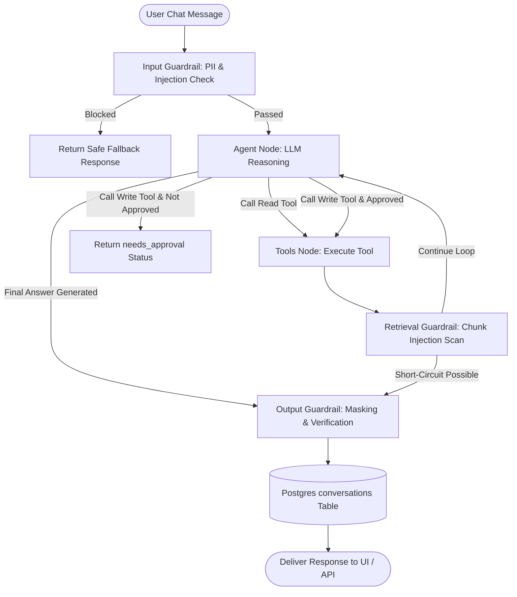

# Agent Executor & Conversational Intelligence Module

The **Agent Module** (`backend/agent/`) coordinates dynamic reasoning loops for the conversational query layer. It combines provider-native tool calling, human-in-the-loop write approvals, sliding-window conversation management, and 3-stage AI safety guardrail interception on a **LangGraph** 2-node cyclic state graph.

---

## 1. Key Capabilities & Features

- **Cyclic LangGraph Agent Architecture**: Lightweight, high-speed 2-node state machine (`agent` $\leftrightarrow$ `tools`) using native provider tool-calling schemas (`llm.bind_tools()`).
- **Human-in-the-Loop Write Gates**: Tools declared under `query.agent.write_tools` (e.g. `ingest_document`) trigger immediate execution pauses, returning `status="needs_approval"` with payload arguments. Actions execute only upon user confirmation (`approved_writes=True`).
- **Search Short-Circuit Optimization**: When `search_documents` delivers a fully grounded, cited answer from the retrieval pipeline, the graph short-circuits Turn 2 LLM calls, eliminating redundant token overhead and reducing latency by up to 50%.
- **Anti-Redundancy Prompting**: Strict system prompt constraints prevent cyclic re-querying and tool thrashing.
- **3-Stage AI Guardrail Interception**:
  - *Pre-Execution*: Evaluates input for prompt injections, jailbreaks, and Indian-market PII ([`input_guard.py`](file:///d:/AI-Acc-updated/AI-Accelerator/backend/guardrails/input_guard.py)).
  - *Post-Tool*: Asynchronously scans retrieved chunks for malicious payloads ([`retrieval_guard.py`](file:///d:/AI-Acc-updated/AI-Accelerator/backend/guardrails/retrieval_guard.py)).
  - *Post-Synthesis*: Verifies groundedness, redacts PII, and applies Indian GSTIN/PAN masking ([`output_guard.py`](file:///d:/AI-Acc-updated/AI-Accelerator/backend/guardrails/output_guard.py)).
- **Sliding-Window Conversation Memory**: Session manager ([`context_manager.py`](file:///d:/AI-Acc-updated/AI-Accelerator/backend/agent/context_manager.py)) maintaining a bounded buffer of clean Q&A pairs (default 20 messages / 10 turns) stored in PostgreSQL.

---

## 2. Core Dependencies & Integrations

- **langgraph**: `StateGraph`, `START`, and `END` coordinating the cyclic agent-tool graph.
- **langchain-core**: Standard message types (`AIMessage`, `HumanMessage`, `SystemMessage`, `ToolMessage`).
- **backend.agent_tools**: Registry of 7 agent-callable tools ([`agent_tools.py`](file:///d:/AI-Acc-updated/AI-Accelerator/backend/agent_tools.py)).
- **backend.guardrails**: 3-stage safety guardrails, policy engine, and session risk accumulators.
- **backend.core.usage & tracing**: Real-time token tracking and OpenTelemetry span nesting.

---

## 3. Architecture & Data Flow



---

## 4. Agent Tools Catalog (`backend/agent_tools.py`)

| Tool Name | Type | Input Arguments | Functionality & Safety Constraints |
|---|---|---|---|
| `search_documents` | Read | `query: str`, `document_id: Optional[str]`, `doc_type: Optional[str]` | Executes hybrid dense/sparse vector search with Jina reranking and full citation generation. |
| `get_page_context` | Read | `document_id: str`, `page_number: int` | Fetches verbatim raw layout text for a specific page from PostgreSQL to resolve fragmented context. |
| `list_documents` | Read | *(none)* | Returns the complete catalog of active ingested documents with metadata and page counts. |
| `sql_read` | Read | `query: str` | Executes read-only SQL queries against relational database tables with strict AST safety validation. |
| `excel_tool` | Read | `document_id: str`, `python_code: str` | Executes sandboxed Python/Pandas data analytics scripts on ingested spreadsheet datasets. |
| `request_clarification`| Read | `question: str`, `options: list[str]` | Prompts the user for clarification when query parameters or document targets are ambiguous. |
| `ingest_document` | Write | `file_path: str` | Ingests a new document file. **Requires human approval before execution.** |

---

## 5. Component & File Reference

| File | Primary Functions / Classes | Role & Implementation Details |
|---|---|---|
| [`executor.py`](file:///d:/AI-Acc-updated/AI-Accelerator/backend/agent/executor.py) | `run_agent()`, `build_agent_graph()`, `AgentState` | Core LangGraph agent runner. Manages state transitions, write approvals, tool dispatches, and guardrail enforcement. |
| [`context_manager.py`](file:///d:/AI-Acc-updated/AI-Accelerator/backend/agent/context_manager.py) | `get_session_history()`, `trim_history()` | Loads, filters, and formats historical conversational turns using a sliding-window message cap. |
| [`clarify_tool.py`](file:///d:/AI-Acc-updated/AI-Accelerator/backend/agent/clarify_tool.py) | `RequestClarificationTool` | Dispatches interactive multiple-choice clarification prompts to the user interface. |
| [`agent_tools.py`](file:///d:/AI-Acc-updated/AI-Accelerator/backend/agent_tools.py) | `AgentTool`, `build_agent_registry()` | Central registry exporting standard schemas and dispatch wrappers for all agent-callable tools. |

---

## 6. Configuration & Testing

### Agent Configuration (`config/global.yaml`)
```yaml
query:
  agent:
    provider: openai
    model: gpt-4o-mini
    max_iterations: 8
    max_history_messages: 20
    write_tools:
      - ingest_document
```

### Verification & Unit Tests
```powershell
# Test agent executor loop, tool calls, and human-in-the-loop approvals
pytest tests/test_agent_executor.py tests/test_context_manager.py

# Test individual agent tools
pytest tests/test_sql_read_tool.py tests/test_search_documents.py tests/test_get_page_context.py
```
