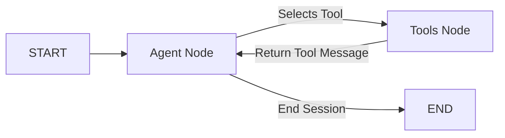

# Agent Executor Module

The Agent module implements the core reasoning loop for the conversational query layer, allowing models to select and run actions dynamically.

## Core Dependencies

* **langgraph**: Coordinates the conversational graph loop (Agent node $\leftrightarrow$ Tools node).
* **langchain-core**: Implements chat message constructs (`AIMessage`, `HumanMessage`, `SystemMessage`, `ToolMessage`).
* **backend.core.llm_client**: Selects and retrieves the model provider.
* **backend.agent_tools**: Wires up the list of available agentic tools.

## System Prompt & Tool-Calling Architecture

The execution graph (`executor.py`) is structured as a two-node LangGraph cyclic loop:

### Registered Tools
* `search_documents`: Queries the indexed vector and database corpus using hybrid search.
* `get_page_context`: Bypasses chunk segments and fetches the raw page layout content from Postgres to resolve fragmented text references.
* `list_documents`: Returns a list of all successfully ingested files.
* `ingest_document`: Ingests a new file.
* `sql_read`: Performs read-only queries.
* `excel_tool`: Runs python/pandas data analysis scripts inside a secure sandbox.
* `request_clarification`: Asks the user to clarify ambiguous requests.

## Core Features

### 1. Human-in-the-Loop Write Approvals
Tools specified under `query.agent.write_tools` (such as `ingest_document`) require explicit human approval before running.
* On the first request, the executor blocks execution, saves state, and returns a `needs_approval` status alongside the pending tool parameters.
* The API/CLI prompts the user for verification. If approved, the agent is re-run with `approved_writes=True`, allowing the tool to execute.

### 2. Conversation Cache & Relational Sync
Every conversation turn is logged to the PostgreSQL `conversations` table. To minimize latency and token usage, the active session is cached in-memory (`_agent_sessions` in `main.py`) per `session_id`. The chat history is filtered strictly for clean Q&A pairs (excluding tool calls and intermediate payloads) and capped at `max_history_messages` (20 messages / 10 Q&A pairs) using a sliding window.

