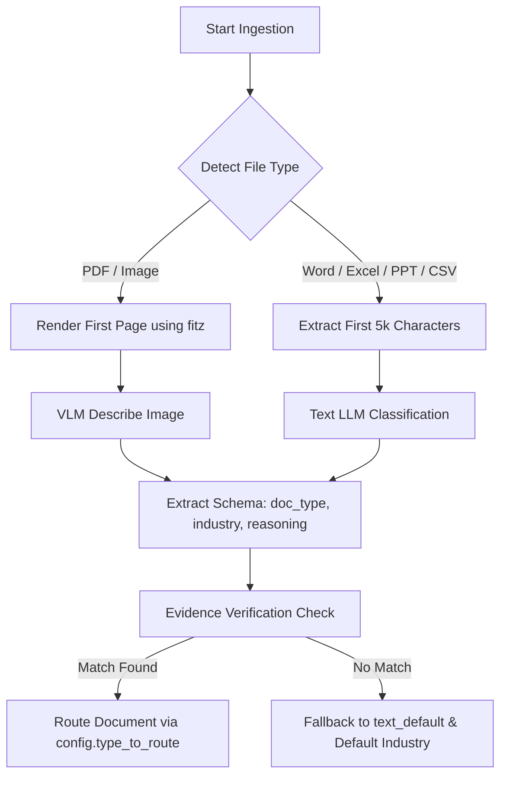

# Categorization & Routing Module

The Categorization module inspects files at the beginning of the ingestion pipeline to classify their structural type, industry context, and routing rules.

## Core Dependencies

* **PyMuPDF (`fitz`)**: Used to extract the first page of PDF documents and render them as images for visual categorization.
* **backend.core.vision_client (`describe_image`)**: Connects to external vision models (Gemini, OpenAI, or Ollama) to analyze rendered page images.
* **backend.core.llm_client (`get_llm_for`)**: Queries text models for spreadsheet, document, and text classifications.
* **langdetect**: Detects the main language of the document.

## Classification Logic & Flow

The main categorization flow resides in `classifier.py::categorize()`:

### Step-by-Step Execution

1. **Format Routing**: The tool sniffs the file extension via `detect_file_type()`.
2. **First-Page Peek**:
   * *PDF/Image*: Renders the first page at 150 DPI to a PNG byte buffer. Sends the image to the multimodal API using `VISION_PROMPT` to extract classification fields.
   * *Word/Excel/PPT/CSV*: Extracts the first 5,000 characters. Sends the text to a text LLM using `CLASSIFIER_PROMPT`.
3. **Grounding Verification (`_evidence_supported`)**:
   * The classification model must return an `"evidence"` phrase alongside its classification.
   * The system checks if this exact text string exists within the document's actual text layers.
   * If the evidence string is absent, the classification is flagged as ungrounded and falls back to standard configurations (e.g. `text_default`).
4. **PDF Kind Detection (`detect_pdf_type`)**:
   * For PDFs, the categorizer invokes `detector.py` to count pages containing vector text paths vs. scanned bitmap regions.
   * Classifies the PDF as `digital`, `scanned`, or `mixed` and writes it to `state["pdf_kind"]` to select the extraction tool.
