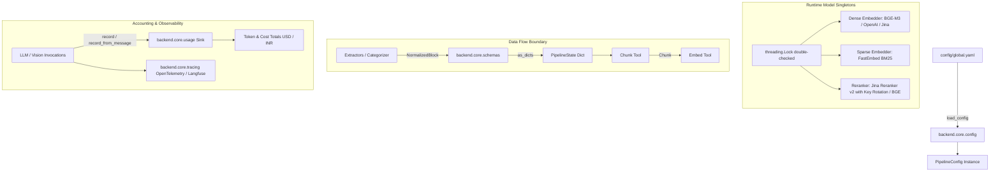

# Core Infrastructure & Shared Contracts Module

The **Core Module** (`backend/core/`) provides foundational data contracts, model singleton managers, configuration parsers, LLM/Vision client wrappers, pacing rate limiters, and token/cost accounting infrastructure. Every tool across the ingestion and query pipelines reads from and writes to the schemas and utilities defined here.

---

## 1. Key Capabilities & Features

- **Standardized Data Contracts**: Pydantic and dataclass models ([schemas.py](file:///d:/AI-Acc-updated/AI-Accelerator/backend/core/schemas.py)) defining structured document units (`NormalizedBlock`), vector elements (`Chunk`), citation anchors (`SourceRef`), and visual metadata (`PageProfile`, `ImageRegion`).
- **Singleton Model Lifecycle Management**: High-performance thread-safe model caching ([models.py](file:///d:/AI-Acc-updated/AI-Accelerator/backend/core/models.py)) for dense embeddings (BGE-M3, Nomic, OpenAI), sparse BM25, and rerankers (Jina Reranker v2 with instant key failover rotation, BGE-reranker).
- **Proactive Process Warm-Up**: Idempotent startup initialization (`warm_up()`) that resolves torch/paddle memory collisions and pre-fetches models with bounded timeouts.
- **Dynamic Configuration Engine**: YAML loader ([config.py](file:///d:/AI-Acc-updated/AI-Accelerator/backend/core/config.py)) with runtime `${ENVIRONMENT_VARIABLE}` expansion, route-gate resolutions, and database connection fallbacks.
- **Resilient Client Abstractions**: Unified LLM ([llm_client.py](file:///d:/AI-Acc-updated/AI-Accelerator/backend/core/llm_client.py)) and Vision ([vision_client.py](file:///d:/AI-Acc-updated/AI-Accelerator/backend/core/vision_client.py)) callers with exponential backoff retries, rate-limit pacing ([pacing.py](file:///d:/AI-Acc-updated/AI-Accelerator/backend/core/pacing.py)), and penalty parameter mapping.
- **Real-Time Token & Multi-Currency Accounting**: Thread-safe, ContextVar-isolated token sink ([usage.py](file:///d:/AI-Acc-updated/AI-Accelerator/backend/core/usage.py)) capturing input/output/reasoning tokens, context windows, audit trails, and dynamic USD/INR cost calculations.
- **Enterprise Observability**: Distributed tracing ([tracing.py](file:///d:/AI-Acc-updated/AI-Accelerator/backend/core/tracing.py)) integrating OpenTelemetry and Langfuse for end-to-end execution spans.

---

## 2. Core Dependencies & Integrations

- **pydantic & dataclasses**: Core schema typing and dictionary serialization (`as_dicts()`).
- **pyyaml & re**: Dynamic YAML configuration loading with regex env interpolation.
- **sentence-transformers & fastembed**: Local dense (`BAAI/bge-m3`, `nomic-embed-text-v1.5`), sparse (BM25), and cross-encoder reranking inference.
- **requests & httpx**: Cloud API integrations for OpenAI, Google Gemini, Anthropic, and Jina AI.
- **langchain-core & langchain-openai**: Standardized chat message objects (`AIMessage`, `HumanMessage`, `SystemMessage`).
- **psycopg**: PostgreSQL connection extraction and pooling support.

---

## 3. Architecture & Data Flow



---

## 4. Component & File Reference

| File | Primary Functions / Classes | Role & Implementation Details |
|---|---|---|
| [`schemas.py`](file:///d:/AI-Acc-updated/AI-Accelerator/backend/core/schemas.py) | `NormalizedBlock`, `Chunk`, `SourceRef`, `PageProfile`, `ImageRegion`, `as_dicts()` | Shared construction schemas. Enforces boundary normalization to plain Python dictionaries for LangGraph state serialization. |
| [`tool.py`](file:///d:/AI-Acc-updated/AI-Accelerator/backend/core/tool.py) | `Tool` Protocol, `PipelineState`, `check_cancelled()`, `IngestionCancelledError` | Defines the single-purpose `Tool.run(state, config)` contract, shared typed state dictionary, and cancellation polling hooks. |
| [`models.py`](file:///d:/AI-Acc-updated/AI-Accelerator/backend/core/models.py) | `get_dense_model()`, `get_sparse_model()`, `get_reranker()`, `warm_up()`, `JinaRerankerAPIClient`, `JinaEmbeddingsAPIClient`, `OpenAIEmbeddingsAPIClient` | Manages local and remote model singletons. Includes automatic comma-separated Jina API key rotation, exponential backoff retries, and startup memory safety warm-up. |
| [`config.py`](file:///d:/AI-Acc-updated/AI-Accelerator/backend/core/config.py) | `load_config()`, `PipelineConfig`, `get_db_url()` | Evaluates environment variable substitutions `${VAR}`, provides section slicing (`config.section("vision")`), and resolves Postgres connection strings. |
| [`llm_client.py`](file:///d:/AI-Acc-updated/AI-Accelerator/backend/core/llm_client.py) | `get_llm_for()`, `invoke_llm()` | Instantiates provider chat clients (OpenAI, Google GenAI, Groq, Ollama, DeepSeek) with direct frequency/presence penalty forwarding and retry logic. |
| [`vision_client.py`](file:///d:/AI-Acc-updated/AI-Accelerator/backend/core/vision_client.py) | `describe_image()`, `get_vision_client()` | Connects to multimodal vision models (Gemini Flash, OpenAI GPT-4o, Claude 3.5) for OCR rescue, diagram captioning, and cover-page classification. |
| [`pacing.py`](file:///d:/AI-Acc-updated/AI-Accelerator/backend/core/pacing.py) | `Pacer`, `pace()` | Token-bucket and minimum-interval pacing utility to prevent HTTP 429 Rate Limit violations on constrained cloud LLM endpoints. |
| [`usage.py`](file:///d:/AI-Acc-updated/AI-Accelerator/backend/core/usage.py) | `using_sink()`, `record()`, `record_from_message()`, `totals()` | ContextVar-isolated token accounting tracking input, output, reasoning tokens, context peak, per-model costs, and full prompt/response audit logs. |
| [`tracing.py`](file:///d:/AI-Acc-updated/AI-Accelerator/backend/core/tracing.py) | `init_tracing()`, `trace_step()`, `record_llm_usage()` | Distributed tracing layer dispatching execution spans and metric counters to OpenTelemetry collectors and Langfuse. |

---

## 5. Configuration & Testing

### Configuration Blueprint (`config/global.yaml`)
```yaml
embeddings:
  dense_provider: "local"             # local | openai | jina
  dense_model: "BAAI/bge-m3"         # 1024-dim
  sparse_model: "Qdrant/bm25"
  reranker_provider: "jina"          # jina | local
  reranker_model: "jina-reranker-v2-base-multilingual"
  reranker_api_key: "${JINA_API_KEY}" # Comma-separated keys supported for auto-rotation

currency:
  default: "USD"
  usd_to_inr: 95.50
```

### Verification & Unit Tests
```powershell
# Verify core schemas and configuration parser
pytest tests/test_schemas.py tests/test_config.py

# Verify singleton model loading and Jina reranker integration
pytest tests/test_jina_reranker.py tests/test_jina_embeddings.py tests/test_openai_embeddings.py
```
