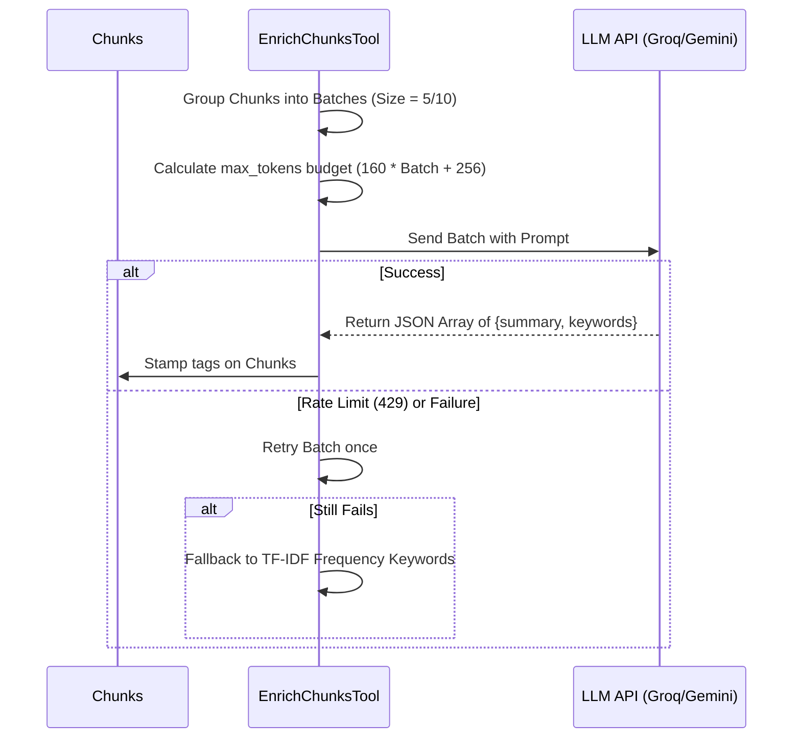

# Enrichment Module

The Enrichment module stamps context tags and summaries onto text chunks using an LLM to improve metadata indexing and search relevance.

## Core Dependencies

* **backend.core.llm_client (`get_llm_for`)**: Connects to the configured text model provider (Groq, OpenAI, or Google AI Studio).
* **re / collections.Counter**: Implements offline fallback TF-IDF keyword counting.

## Execution Flow & Logic

The enrichment process runs in `EnrichChunksTool::run()`:

### Key Mechanisms

1. **Batching Prompt Execution**:
   * Chunks are grouped into batches (default size: 5 or 10). A single prompt asks the LLM to process the batch and return a JSON array containing `summary` and `keywords` objects.
   * This reduces API round-trips and stays within rate limits.
2. **Dynamic completion budget (`max_tokens`)**:
   * The tool sets `max_tokens` dynamically:
     $$\text{budget} = 160 \times \text{batch\_size} + 256$$
   * This prevents output JSON truncation.
3. **Pacing Delay (`min_interval_s`)**:
   * The module sleeps for `min_interval_s` (default: 2.0s) between API calls to avoid rate limits on free-tier services like Groq.
4. **Offline Keyword Fallback**:
   * If LLM services are offline or fail, the system falls back to calculating TF-IDF scores for words in the chunk (excluding stopwords in `_STOPWORDS`) to extract key terms.
