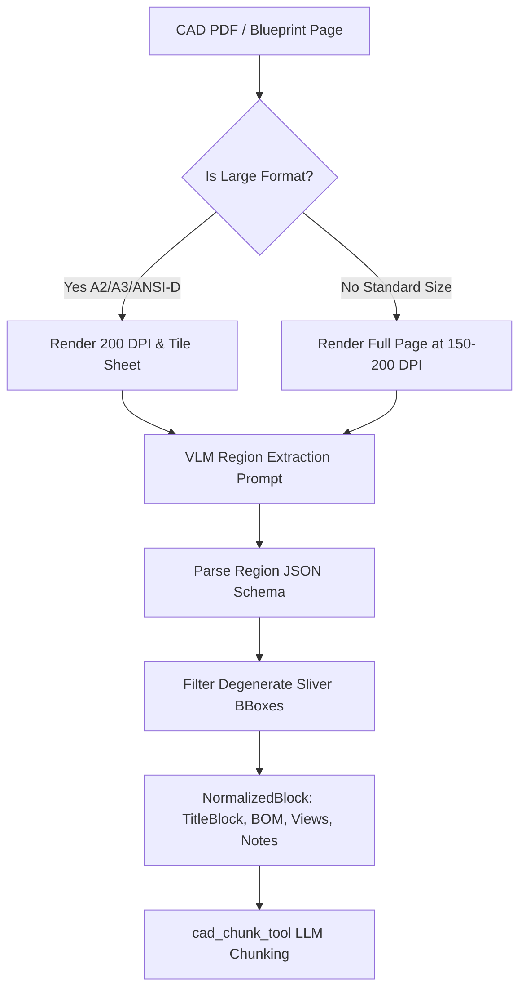

# CAD & Circuit Schematic Extraction Module

The **CAD Extraction Module** (`backend/extraction/cad/`) extracts structured engineering metadata, drawings, BOM tables, wire lists, and annotations from mechanical blueprints and electrical circuit schematics.

---

## 1. Key Capabilities & Features

- **Dual-Domain Prompting** ([`drawing_prompt.py`](file:///d:/AI-Acc-updated/AI-Accelerator/backend/extraction/cad/drawing_prompt.py)):
  - `cad_route` (Mechanical): Extracts title block metadata (drawing number, revision, scale, material), drawing views, section views, parts list tables (BOM), dimensions, tolerances, and notes.
  - `circuit_route` (Electrical): Captures circuit components, reference designators (`R1`, `C4`, `U2`), net names (`5V_RAIL`, `GND`), connector types, pin assignments, and wire lists.
- **Large-Format High-DPI Tiling**:
  - Automatically splits oversized sheets (A2, A3, ANSI-D, ANSI-E) into overlapping high-resolution tiles, passes each tile through the multimodal vision model, and merges coordinates back to page scale.
- **Degenerate Box & Sliver Filtering**:
  - Filters out collapsed bounding boxes and artifact slivers (`_is_degenerate_sliver()`) to prevent corrupted layout geometry.
- **Single-Pass Execution**:
  - Produces pre-captioned blocks with `pending_vision=False`, bypassing redundant downstream captioning steps.

---

## 2. Dependencies & Integrations

- **fitz (PyMuPDF)**: High-DPI page rendering to PNG byte buffers.
- **backend.core.vision_client (`describe_image`)**: Connects to Google Gemini (e.g. Gemini 3.5 Flash) or NVIDIA NIM vision models.
- **backend.extraction.large_format**: Tiling and bounding-box re-projection engine.

---

## 3. Architecture & Data Flow



---

## 4. Configuration & Testing

### Configuration Blueprint (`config/global.yaml`)
```yaml
extraction:
  cad:
    max_pages: 0                      # 0 = unlimited
    vision:
      provider: google
      model: gemini-3.5-flash
      dpi: 200
      timeout_s: 150
```

### Verification
```powershell
# Run extraction test suite
pytest tests/test_smoke.py
```
