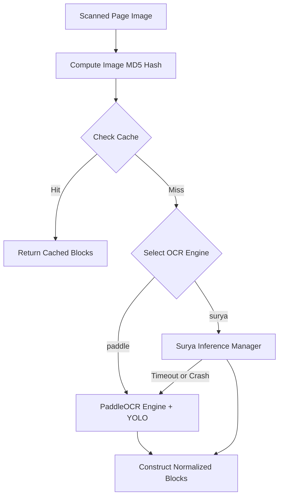

# Scanned PDF Extraction Module

The Scanned PDF Extraction module parses scanned (image-only) and mixed-format PDF documents using deep-learning layout models and Optical Character Recognition (OCR).

## Dependencies

* **surya**: Deep-learning OCR and layout parsing engine (requires `RecognitionPredictor` and `SuryaInferenceManager`).
* **paddleocr**: High-performance, lightweight multi-language OCR fallback engine.
* **OpenCV (`cv2`)**: Used for image preprocessing, page alignment, and computer-vision contour layout detection.
* **PyMuPDF (`fitz`)**: Used to rasterize PDF vector pages into high-DPI images.
* **numpy / Pillow (`PIL`)**: Image pixel arrays processing.
* **concurrent.futures**: Limits OCR execution times.

## OCR Engines & Execution Logic

The tool processes documents page-by-page. For each page, it can use one of two configured OCR backends:

### 1. Surya OCR Engine (Default)
* Combines text line recognition and region layout segment identification in a single pass.
* **macOS Fork Prevention (`warm_surya`)**: Surya forks a background `llama-server` process. Since macOS restricts forking from sub-threads (triggering `os_unfair_lock` SIGKILL crashes), the server **must** be initialized on the main thread during startup (`warm_surya`).
* **Execution Timeout Safeguard**: To prevent Surya from locking up on complex sheets, page parsing is wrapped in `_surya_with_timeout()`. If execution exceeds `_SURYA_TIMEOUT_S` (default: 90s), the process is aborted and falls back to PaddleOCR.

### 2. PaddleOCR & YOLO Engine (Fallback)
* Uses `paddleocr` to detect characters and extract raw text strings.
* Identifies visual bounding blocks (figures and charts) using a DocLayout-YOLO model or OpenCV image contours.

### 3. Memoization Caching
* Computes the MD5 hash of rendered page pixels (`_img_hash`).
* Caches results in `_ocr_cache` and `_region_cache`. Since the page profiler and extractor process pages at different stages, this caching avoids running expensive OCR runs twice.
