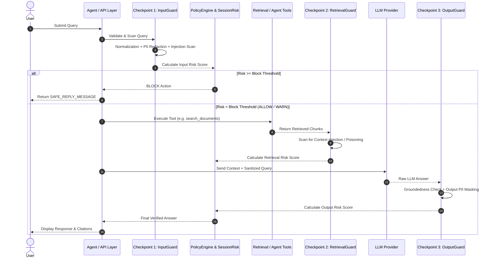

# 3-Stage AI Safety Guardrails & Policy Engine Module

The **Guardrails Module** (`backend/guardrails/`) implements an enterprise multi-checkpoint safety and compliance system designed to protect against prompt injections, adversarial jailbreaks, PII leakage (specifically tailored for Indian and global compliance standards), context stuffing, and hallucinated model responses.

---

## 1. Key Capabilities & Features

- **3-Checkpoint Defense Architecture**:
  1. **Input Guardrail** ([`input_guard.py`](file:///d:/AI-Acc-updated/AI-Accelerator/backend/guardrails/input_guard.py)): Enforces query character caps, scans for adversarial prompt injections across Unicode NFKC normalizations, detects imperative jailbreak verbs ("ignore previous instructions", "act as"), and redacts PII before queries reach the LLM.
  2. **Retrieval Guardrail** ([`retrieval_guard.py`](file:///d:/AI-Acc-updated/AI-Accelerator/backend/guardrails/retrieval_guard.py)): Asynchronously scans retrieved context chunks for indirect prompt injections and payload poisoning attacks.
  3. **Output Guardrail** ([`output_guard.py`](file:///d:/AI-Acc-updated/AI-Accelerator/backend/guardrails/output_guard.py)): Enforces strict output PII masking, groundedness scoring against source context, and structural sanitization.
- **Indian & Global PII Detection Engine**:
  - Implements collision-safe detection ordering: `GSTIN → PAN → Aadhaar → Credit Card → Email → UPI Handle (50+ bank handles) → Phone Number (+91)`.
- **Dynamic Policy & Risk Engine** ([`policy_engine.py`](file:///d:/AI-Acc-updated/AI-Accelerator/backend/guardrails/policy_engine.py)):
  - Evaluates weighted composite risk scores:
    $$\text{Total Risk} = 1.0 \times \text{InputScore} + 1.2 \times \text{RetrievalScore} + 1.5 \times \text{OutputScore}$$
  - Triggers granular actions: `ALLOW`, `WARN` (log & redact), or `BLOCK` (short-circuit to safe fallback response).
- **Session Risk Accumulation** ([`session_risk.py`](file:///d:/AI-Acc-updated/AI-Accelerator/backend/guardrails/session_risk.py)):
  - Aggregates rolling risk across multi-turn sessions (in-memory sliding window or Redis cluster) to detect slow-bleed adversarial probing.
- **Token Quota & Budget Enforcement**:
  - [`token_quota.py`](file:///d:/AI-Acc-updated/AI-Accelerator/backend/guardrails/token_quota.py): Sliding-window rate limiting on LLM token consumption.
  - [`token_budget.py`](file:///d:/AI-Acc-updated/AI-Accelerator/backend/guardrails/token_budget.py): Greedy chunk packing within maximum context token boundaries.
- **Resilient Fail-Open Design** ([`safe_wrapper.py`](file:///d:/AI-Acc-updated/AI-Accelerator/backend/guardrails/safe_wrapper.py)):
  - Non-fatal exceptions log telemetry alerts (`bypassed=True`) and fail open, ensuring system availability.

---

## 2. Core Dependencies & Integrations

- **re & unicodedata**: NFKC Unicode normalization and high-speed compiled regex patterns.
- **backend.agent.executor**: Direct pre-execution, post-tool, and post-synthesis checkpoint interception.
- **backend.core.usage**: Token quota metrics tracking.
- **redis (optional)**: Distributed multi-turn session risk accumulation.

---

## 3. Architecture & Data Flow



---

## 4. Component & File Reference

| File | Primary Functions / Classes | Role & Implementation Details |
|---|---|---|
| [`input_guard.py`](file:///d:/AI-Acc-updated/AI-Accelerator/backend/guardrails/input_guard.py) | `check_input()`, `_GSTIN`, `_PAN`, `_AADHAAR`, `_UPI_HANDLES` | Checkpoint 1 validator: query length limits, NFKC injection regex, imperative verb detection, and Indian PII redaction. |
| [`retrieval_guard.py`](file:///d:/AI-Acc-updated/AI-Accelerator/backend/guardrails/retrieval_guard.py) | `scan_tool_output_async()`, `scan_chunks()` | Checkpoint 2 scanner: scans tool outputs and retrieved chunks for payload injections. |
| [`output_guard.py`](file:///d:/AI-Acc-updated/AI-Accelerator/backend/guardrails/output_guard.py) | `mask_output()`, `check_groundedness()` | Checkpoint 3 sanitizer: masks PII in final text and validates factual grounding against source chunks. |
| [`policy_engine.py`](file:///d:/AI-Acc-updated/AI-Accelerator/backend/guardrails/policy_engine.py) | `PolicyEngine`, `evaluate_policy()` | Evaluates composite multi-stage risk scores against `block_threshold` (default 80) and `warn_threshold` (default 40). |
| [`session_risk.py`](file:///d:/AI-Acc-updated/AI-Accelerator/backend/guardrails/session_risk.py) | `SessionRiskAccumulator`, `get_accumulator()` | Tracks multi-turn risk scores per `session_id` using in-memory rolling windows or Redis. |
| [`token_budget.py`](file:///d:/AI-Acc-updated/AI-Accelerator/backend/guardrails/token_budget.py) | `TokenBudgetManager` | Selects and packs chunks greedily to maximize retrieval coverage within token context budgets. |
| [`token_quota.py`](file:///d:/AI-Acc-updated/AI-Accelerator/backend/guardrails/token_quota.py) | `TokenQuotaManager` | Enforces sliding-window token consumption rate limits per user/tenant. |
| [`trust_registry.py`](file:///d:/AI-Acc-updated/AI-Accelerator/backend/guardrails/trust_registry.py) | `TrustRegistry` | Weighting table assigning trustworthiness multipliers based on document type. |
| [`event_logger.py`](file:///d:/AI-Acc-updated/AI-Accelerator/backend/guardrails/event_logger.py) | `log_event()` | Persists structured guardrail audit records into ring buffers and telemetry sinks. |
| [`safe_wrapper.py`](file:///d:/AI-Acc-updated/AI-Accelerator/backend/guardrails/safe_wrapper.py) | `guardrail_safe()` | Decorator providing transparent fail-open exception handling. |

---

## 5. Configuration & Testing

### Guardrails Configuration (`config/global.yaml`)
```yaml
guardrails:
  enabled: true
  version: 1.0.0
  policy:
    block_threshold: 80
    warn_threshold: 40
    stage_weights:
      input: 1.0
      retrieval: 1.2
      output: 1.5
  input:
    max_query_chars: 2000
    pii_redact: true
    injection_check: true
  retrieval:
    chunk_injection_scan: true
  output:
    pii_mask: true
  token_budget:
    enabled: true
    max_context_tokens: 20000
```

### Verification & Unit Tests
```powershell
# Run guardrail verification suite
pytest tests/test_guardrails.py
```
