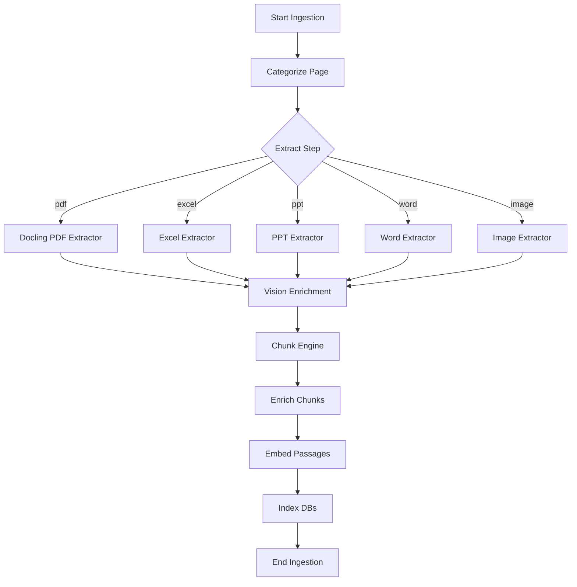

# Pipeline Graph Module

The Pipeline module compiles YAML configuration step lists into execution graphs using LangGraph.

## Core Dependencies

* **langgraph**: Builds the StateGraph state machine.
* **backend.core.tool**: Implements the tool run protocols.
* **backend.pipeline.default_registry**: Maps step names to pipeline tool instances.

## Execution Architecture (`graph.py`)

The pipeline compiles ingestion and query step arrays from `config/global.yaml` into sequential `StateGraph` workflows:

### Dynamic Routing Features

1. **Route-Gate Checks (`route_gates`)**:
   * Evaluates step execution based on the active route (e.g. `vision_enrichment` only runs on `diagram_heavy` routes, bypassing normal text documents).
2. **Extraction Dispatches (`extract` Placeholder)**:
   * The pipeline registers a generic `extract` placeholder step. During execution, it resolves the file type and dispatches the request to the matching extractor (e.g., `docling_pdf` or `ExcelExtractorTool`).
3. **Safe Node Execution**:
   * Nodes are wrapped in exception catch blocks. If a step fails, the system logs the exception details in `state["errors"]` and continues the pipeline run, ensuring overall robustness.
