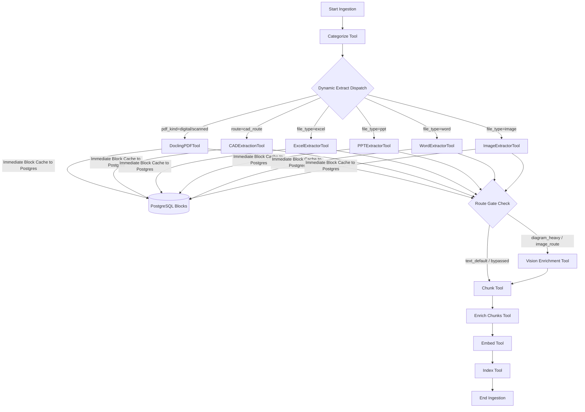

# Pipeline Graph & Orchestration Module

The **Pipeline Module** (`backend/pipeline/`) compiles declarative YAML configuration step lists into runtime directed acyclic execution graphs (DAGs) using **LangGraph**. It coordinates both the ingestion and query pipelines with route-gated step filtering, extractor dispatching, immediate database block caching, and fault-tolerant node execution.

---

## 1. Key Capabilities & Features

- **Declarative Graph Compilation**: Builds dynamic LangGraph `StateGraph` state machines from `config/global.yaml` without hardcoded execution logic.
- **Dynamic Extractor Resolution**: Expands the generic `extract` placeholder at runtime based on route overrides (`route_extractors`), PDF classifications (`pdf_extractors`), or file format mappings (`extractors`).
- **Route-Gate Filtering**: Conditionally executes expensive pipeline steps (such as `vision_enrichment` or `cad_chunk_tool`) based on document classifications (`route_gates`).
- **Immediate Block Caching**: Extractor nodes persist parsed `NormalizedBlock[]` directly to PostgreSQL via `pg.write_blocks()`. Subsequent runs reuse cached blocks, bypassing heavy parser re-runs.
- **Fail-Safe Node Resilience**: Graph nodes wrap tool execution in try/catch blocks; tool errors append diagnostic traces to `state["errors"]` and emit handled error telemetry without halting the pipeline.
- **Cancellation & Lifecycle Control**: Polls document cancellation states (`check_cancelled()`) between steps to abort stale background jobs.

---

## 2. Core Dependencies & Integrations

- **langgraph**: `StateGraph`, `START`, and `END` nodes managing sequential and conditional flow execution.
- **backend.core.tool**: `Tool` protocol, `PipelineState` typing, and `IngestionCancelledError`.
- **backend.core.registry**: `ToolRegistry` managing lazy instantiation and defensive imports.
- **backend.storage.postgres_store**: `PostgresStore` for immediate block caching and document status logging.
- **backend.core.tracing**: `traced_tool` OpenTelemetry spans and metric tracking.

---

## 3. Architecture & Data Flow



---

## 4. Component & File Reference

| File | Primary Functions / Classes | Role & Implementation Details |
|---|---|---|
| [`graph.py`](file:///d:/AI-Acc-updated/AI-Accelerator/backend/pipeline/graph.py) | `build_pipeline()`, `run_pipeline()`, `_make_node()`, `EXTRACT_PLACEHOLDER` | Compiles `PipelineConfig` into a LangGraph `StateGraph`. Implements node execution metrics, OpenTelemetry span nesting, and block caching. |
| [`ingest.py`](file:///d:/AI-Acc-updated/AI-Accelerator/backend/pipeline/ingest.py) | `ingest_document()`, `IngestTool` | Ingestion entrypoint executing the document processing graph. Handles file sniffing, root trace generation, and token sink setup. |
| [`query.py`](file:///d:/AI-Acc-updated/AI-Accelerator/backend/pipeline/query.py) | `run_query()`, `QueryTool` | Query-side graph runner coordinating query planning, tiered retrieval, reranking, context expansion, and conversation logging. |
| [`default_registry.py`](file:///d:/AI-Acc-updated/AI-Accelerator/backend/pipeline/default_registry.py) | `_TOOL_SPECS`, `create_default_registry()` | Default factory registering all pipeline tools defensively. Safely ignores uninstalled optional dependencies. |

---

## 5. Configuration & Testing

### Pipeline Configuration (`config/global.yaml`)
```yaml
ingestion:
  steps:
    - categorize
    - extract
    - vision_enrichment
    - chunk
    - enrich_chunks
    - embed
    - index

  route_gates:
    vision_enrichment:
      - diagram_heavy
      - image_route
      - scanned_form

query:
  steps:
    - query_planner
    - retrieval
    - answerer
```

### Verification & Unit Tests
```powershell
# Test pipeline graph compilation and tool registry
pytest tests/test_graph.py tests/test_registry.py

# Test end-to-end ingestion pipeline flow
pytest tests/test_ingest.py
```
