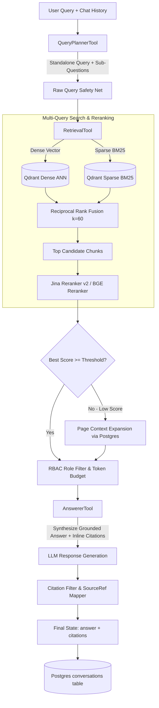

# Retrieval & Grounded Answering Module

The **Retrieval Module** (`backend/retrieval/`) executes query planning, multi-stage hybrid vector search, cross-encoder reranking, page-level context expansion, and cited grounded answer generation.

---

## 1. Key Capabilities & Features

- **Context-Aware Query Planner** ([`query_planner.py`](file:///d:/AI-Acc-updated/AI-Accelerator/backend/retrieval/query_planner.py)):
  - Contextualizes conversational follow-ups by resolving pronouns ("it", "they", "its cost") using conversation history.
  - Decomposes complex multi-part questions into focused sub-questions (capped at `max_sub_questions`, default 4).
  - Preserves domain acronyms and technical terms verbatim without hallucinating product expansions.
  - **Verbatim Safety Net**: Injects the raw user query alongside decomposed sub-questions to prevent query-planner starvation.
- **Unified Multi-Stage Retrieval Engine** ([`retrieval.py`](file:///d:/AI-Acc-updated/AI-Accelerator/backend/retrieval/retrieval.py)):
  - **Dense ANN**: Fast vector similarity search in Qdrant collections.
  - **Sparse Lexical**: Exact BM25 keyword matching via Qdrant Fastembed sparse vectors.
  - **Reciprocal Rank Fusion (RRF)**: Merges dense and sparse rankings ($k=60$):
    $$\text{RRF Score}(d) = \frac{1}{60 + \text{Rank}_{\text{dense}}(d)} + \frac{1}{60 + \text{Rank}_{\text{sparse}}(d)}$$
  - **Jina Reranker v2 & Cross-Encoder**: High-precision cross-encoder scoring with automatic multi-key rotation and local BGE-reranker fallback.
  - **Soft-Filter Recovery**: If metadata filters (`doc_type`, `industry`) return 0 hits, automatically retries across the document scope without soft constraints.
- **Adaptive Fallback & Context Expansion**:
  - Automatically detects low-confidence fragment scores ($< \text{threshold}$) and expands chunks to full page blocks from PostgreSQL (`_expand_chunks_to_pages`).
  - Integrates `TokenBudgetManager` to greedily pack maximal relevant context without exceeding LLM context windows.
- **Strict Grounded Synthesis** ([`answerer.py`](file:///d:/AI-Acc-updated/AI-Accelerator/backend/retrieval/answerer.py)):
  - Generates answers strictly from provided context passages, copying part numbers, tolerances, and specs verbatim.
  - Formats mathematical formulas using standard Markdown LaTeX (`$x$` inline, `$$f(x)$$` display).
  - Parses and correlates inline numerical citations `[1]`, `[2]` directly to document source references (`filename`, `page`, `bbox`, `table_data`, `image_path`).
  - Persists query turns and answers into PostgreSQL `conversations` table.

---

## 2. Core Dependencies & Integrations

- **qdrant-client**: Vector ANN and sparse BM25 payload search.
- **sentence-transformers / fastembed / jina**: Dense embeddings and cross-encoder reranking.
- **backend.core.models**: Singleton model managers and Jina API failover client.
- **backend.core.llm_client**: LLM completions for query planning and grounded answering.
- **backend.storage.postgres_store & pg_store**: PostgreSQL context expansion and conversation audit logging.
- **backend.guardrails.token_budget**: Greedy token budget manager.

---

## 3. Architecture & Data Flow



---

## 4. Component & File Reference

| File | Primary Functions / Classes | Role & Implementation Details |
|---|---|---|
| [`query_planner.py`](file:///d:/AI-Acc-updated/AI-Accelerator/backend/retrieval/query_planner.py) | `QueryPlannerTool`, `_plan()` | Contextualizes follow-up questions, decomposes complex prompts, enforces acronym preservation, and ensures verbatim query inclusion. |
| [`retrieval.py`](file:///d:/AI-Acc-updated/AI-Accelerator/backend/retrieval/retrieval.py) | `RetrievalTool`, `_retrieve_multi_query_rerank()`, `_retrieve_one()`, `_expand_chunks_to_pages()` | Hybrid dense/sparse search runner, Jina reranker integration, soft-filter fallback, RBAC filtering, and page expansion. |
| [`answerer.py`](file:///d:/AI-Acc-updated/AI-Accelerator/backend/retrieval/answerer.py) | `AnswererTool`, `_filter_cited_citations()`, `_looks_like_refusal()` | Synthesizes grounded responses, formats LaTeX math, matches bracketed citations to chunk metadata, and records PostgreSQL conversation turns. |
| `vector_store.py` | `VectorStore` | Wrapper querying Qdrant dense and sparse vector collections with payload filters. |
| `keyword_index.py` | `KeywordIndex` | Lexical search fallback helper for keyword matching. |
| `pg_store.py` | `PGStore` | Direct database reader for retrieving full page text and conversation logging. |

---

## 5. Configuration & Testing

### Configuration Blueprint (`config/global.yaml`)
```yaml
query:
  planner:
    max_sub_questions: 4
  retrieval:
    method: hybrid_rerank              # naive | hybrid | hybrid_rerank | hyde | enriched
    top_n: 20
    candidate_k: 80
    rerank_top_k: 5
    dense_weight: 0.6
    sparse_weight: 0.4
    fallback_enabled: true
    fallback_threshold: -1.0
    fallback_top_k: 2
```

### Verification & Unit Tests
```powershell
# Test query planning, retrieval, and answering
pytest tests/test_query.py tests/test_retrieval.py tests/test_answerer_expand.py

# Test search documents tool and procedure search
pytest tests/test_search_documents.py tests/test_tiered_procedure_search.py tests/test_guided_procedure_multi_file.py
```
