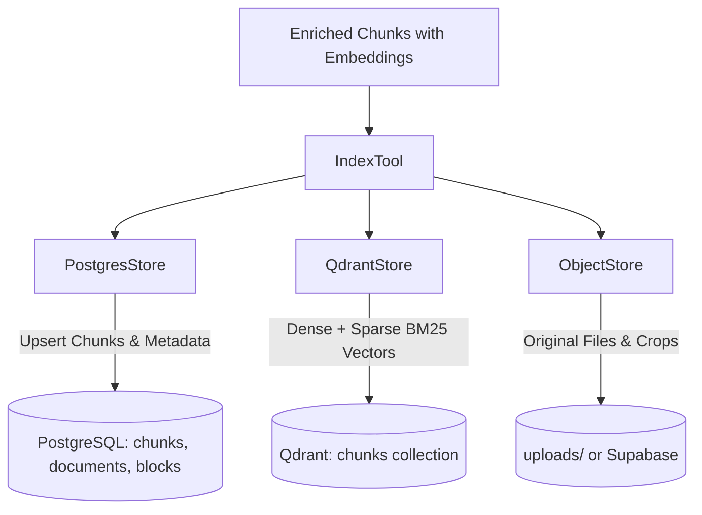

# Persistence & Storage Subsystem

The **Storage Module** (`backend/storage/`) manages multi-tier enterprise persistence across relational database records (**PostgreSQL**), vector search indexes (**Qdrant**), and binary object stores (**Local Disk / Supabase Storage**).

---

## 1. Key Capabilities & Features

- **Relational Data Management** ([`postgres_store.py`](file:///d:/AI-Acc-updated/AI-Accelerator/backend/storage/postgres_store.py)):
  - Manages schemas for `documents` (status, metadata, processing metrics), `chunks` (text, token counts, JSON table matrices, image paths), `document_blocks` (immediate raw block cache), and `conversations` (chat history).
  - Sanitizes data against PostgreSQL byte constraints (`_strip_nul` removes `\x00` PDF artifacts) and provides JSON serialization for Pandas datetime/decimal objects.
  - Connection pooling with `autocommit=True` to prevent transaction stalls.
- **Hybrid Vector Indexing** ([`qdrant_store.py`](file:///d:/AI-Acc-updated/AI-Accelerator/backend/storage/qdrant_store.py)):
  - Manages dual-vector collections in Qdrant: Dense vectors (768/1024-dim cosine distance) and named Sparse vectors (Fastembed BM25).
  - Configures indexed payload schema keys (`document_id`, `industry`, `doc_type`, and tag keys) for sub-millisecond filtered ANN queries.
- **Object Storage Abstraction** ([`object_store.py`](file:///d:/AI-Acc-updated/AI-Accelerator/backend/storage/object_store.py)):
  - Persists original uploads, cropped visual figures, and page screenshots to `uploads/` (or Supabase Object Storage bucket).
- **Safe Index Orchestrator** ([`index_tool.py`](file:///d:/AI-Acc-updated/AI-Accelerator/backend/storage/index_tool.py)):
  - Writes text records to PostgreSQL first, then uploads vectors to Qdrant. Handles partial vector failures gracefully without aborting ingestion.

---

## 2. Dependencies & Integrations

- **psycopg**: High-performance PostgreSQL driver.
- **qdrant-client**: Driver for local and cloud Qdrant vector database clusters.
- **scripts/init_db.sql**: Master DDL schema definition.

---

## 3. Architecture & Data Flow



---

## 4. Configuration & Testing

### Configuration Blueprint (`config/global.yaml`)
```yaml
database:
  postgres_url: ${POSTGRES_URL}
  qdrant_url: ${QDRANT_URL}
  qdrant_api_key: ${QDRANT_API_KEY}
  qdrant_collection: chunks
```

### Verification & Unit Tests
```powershell
# Run storage persistence tests
pytest tests/test_storage.py tests/test_conversation_store.py
```
