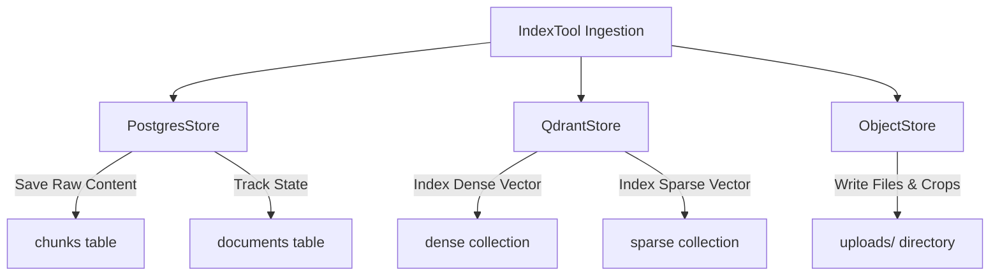

# Storage Module

The Storage module manages data persistence, integrating relational database rows, vector indexes, and object files.

## Dependencies

* **psycopg**: PostgreSQL driver supporting pooled connections and JSON data mapping.
* **qdrant-client**: Driver for Qdrant database clusters.
* **os / shutil**: Manages local disk storage.

## Store Integrations

Data is split between PostgreSQL, Qdrant, and local disk:

### 1. Relational Store (`PostgresStore`)
* Manages schemas for `documents` (ID, status, filename, type, size, categorization data, and processing logs), `chunks` (ID, text, tokens, tag lists, table JSON structures, image references), and `conversations` (chat history).
* Implements connection recovery: initializes connection pools using `psycopg.connect()` with `autocommit=True`.

### 2. Vector Store (`QdrantStore`)
* Configures Qdrant collections. Registers the dense vector schema (768 or 1024 dimensions) and the named sparse vector collection.
* Maps metadata properties (`document_id`, `industry`, `doc_type`, and tag keys) as searchable payload fields.

### 3. Object Store (`ObjectStore`)
* Persists original files, cropped illustrations, and page images to `uploads/`. Implements a file-system writer that can be swapped with AWS S3/MinIO connectors.

### 4. Index Orchestrator (`index_tool.py`)
* Processes the pipeline output chunks. Writes raw text records to PostgreSQL first, then uploads dense and sparse vectors to Qdrant.
* **Partial Ingestion Safety**: If a chunk lacks a vector because the embedding step failed, the indexing tool skips the Qdrant write for that chunk, records a warning, and saves the text record to Postgres, allowing ingestion to finish.
