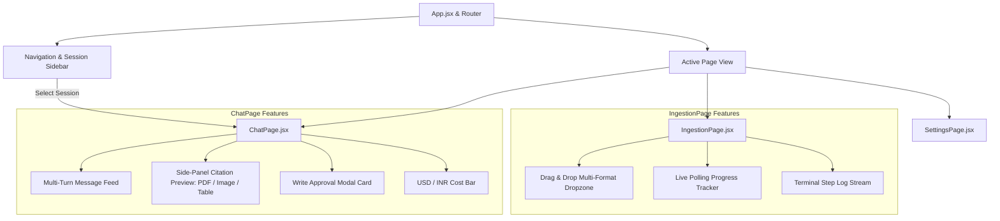

# React UI Frontend Subsystem

The **Frontend Subsystem** (`frontend/`) is a modern React 18 single-page application (SPA) built with **Vite** and **Tailwind CSS**. It provides an interactive document ingestion dashboard, a conversational agent chat interface with side-by-side citation previews, and dynamic configuration controls.

---

## 1. Key Capabilities & Features

- **Conversational Document Intelligence** ([`ChatPage.jsx`](file:///d:/AI-Acc-updated/AI-Accelerator/frontend/src/components/ChatPage.jsx)):
  - Multi-turn conversational interface with streaming markdown rendering.
  - **Clickable Inline Citations**: Clicking citations `[1]`, `[2]` opens a synchronized side-panel preview displaying high-resolution page crops, structured table matrices, or persistent PDF views.
  - **Tool-Call Execution Badges**: Real-time visualization of agent reasoning steps (e.g. `search_documents`, `get_page_context`, `sql_read`, `excel_tool`).
  - **Human-in-the-Loop Write Approval Cards**: Renders interactive approval prompts when the agent requests write actions (e.g. `ingest_document`), allowing users to approve or decline.
  - **Real-Time Token & Multi-Currency Cost Display**: Displays per-turn and session token counts with an instant currency toggle between **USD ($)** and **INR (₹)**.
  - **Sidebar Session History**: Historical conversation thread list retrieved from `GET /agent/sessions` with creation timestamps and deletion actions.
- **Document Ingestion Dashboard** ([`IngestionPage.jsx`](file:///d:/AI-Acc-updated/AI-Accelerator/frontend/src/components/IngestionPage.jsx)):
  - Drag-and-drop file upload supporting PDFs, Word documents, Excel workbooks, PowerPoint presentations, and images.
  - Real-time polling progress bar tracking pipeline stages (`categorize → extract → vision → chunk → enrich → embed → index`).
  - Diagnostic process logging console rendering live error and step telemetry.
- **Dynamic Configuration & Hyperparameters** ([`SettingsPage.jsx`](file:///d:/AI-Acc-updated/AI-Accelerator/frontend/src/components/SettingsPage.jsx)):
  - Model provider selector (OpenAI, NVIDIA NIM, Google Gemini, Ollama) and live prompt template editor.

---

## 2. Technology Stack

- **React 18**: Component architecture and state hooks.
- **Vite**: Ultra-fast development server and production bundler.
- **Tailwind CSS / PostCSS**: Modern utility-first responsive styling.
- **React Router**: Client-side routing across `/chat`, `/ingest`, and `/settings`.
- **lucide-react**: Clean vector iconography.

---

## 3. Architecture & Component Hierarchy



---

## 4. Running & Building

```bash
# Navigate to frontend directory
cd frontend

# Install dependencies
npm install

# Start Vite local development server
npm run dev

# Build production bundle
npm run build
```
