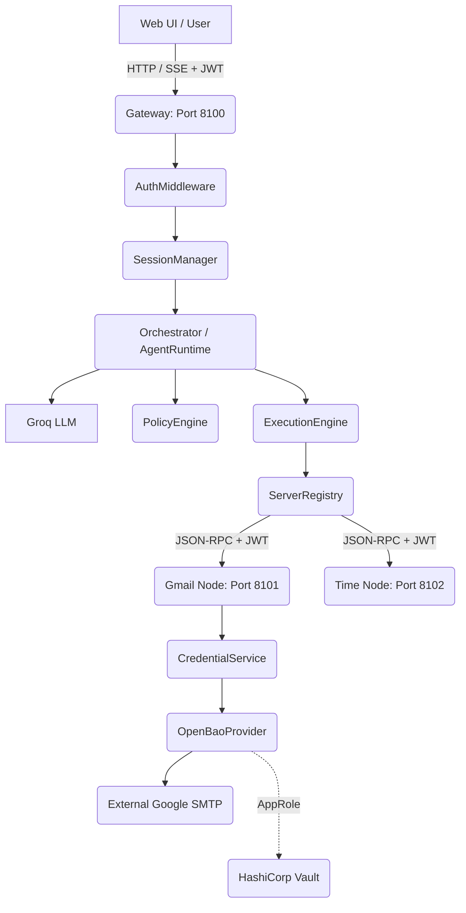

# MCP System Architecture

## 1. Architecture Overview
The system acts as a Zero-Trust Model Context Protocol (MCP) Multi-Agent AI Gateway. It decouples the Web Interface, the AI Orchestration layer, and the Physical Tool Microservices securely over JSON-RPC 2.0.

## 2. Component Diagram

## 3. Request Lifecycle
1. User supplies a prompt string over HTTP POST. 
2. Gateway verifies JWT Auth. 
3. LLM creates execution plan.
4. Orchestrator verifies allowed tools.
5. ServerRegistry proxies to correct microservice.
6. Execution completes and answers synthesize.

## 4. Authentication Flow (CURRENT)
- Client passes `Authorization: Bearer <TOKEN>`.
- `AuthMiddleware` verifies HMAC signature.
- `IdentityService` maps `sub` to specific `agentId`.

## 5. Authorization Flow (CURRENT)
- The Gateway intercepts the request.
- `PolicyEngine` ingests `agents.yaml` + `roles.yaml`.
- Analyzes `agent limits` vs `role ceilings`.
- Emits `ALLOW`, `DENY`, or `REQUIRE_APPROVAL`.

## 6. Session Flow (CURRENT)
- `SessionManager` binds SSE streams specifically to the authorized identity.
- Keeps queues for streaming JSON responses back asynchronously.
- *Cache implemented strictly for direct `tools/call` with 300s TTL.*

## 7. Agent/Orchestrator Flow (CURRENT)
- `Planner` dictates the instructions.
- `DecisionEngine` links instructions to the 7 registered schema capabilities.
- `AgentRuntime` executes them consecutively on a single thread.

## 8. Tool Execution Flow (CURRENT)
- JSON-RPC targets tool.
- Proxied over HTTP.
- Microservice natively executes business logic (e.g., IMAP reads).
- Synthesizes dict -> string -> back to Hub.

## 9. Credential/OpenBao Flow (CURRENT)
- When a service requires secret external data `get("smtp")`...
- `OpenBaoProvider` queries environment.
- Executes `POST /v1/auth/approle/login`.
- Extracts `client_token`.
- Executes `GET secret/data/mcp/smtp`.
- Discards external keys post-execution.

## 10. Audit/Correlation Flow (CURRENT)
- `AuditLogger` consumes all interactions, writing synchronously.
- Passes `correlation_id` header physically across HTTP ports to stitch distributed logs.

## 11. Configuration Flow (CURRENT)
- `config.yaml` dictates active ports and JWT boundaries.
- `roles.yaml` + `agents.yaml` dictate static policy logic on bootup (or via hot reloading).

## 12. Error/Failure Flow (CURRENT)
- `make_jsonrpc_error` shields core application stacktraces, sanitizing Python internals. Pydantic validation cleanly exposed in standard format.

## 13. Security Boundaries
- **AuthN Boundary:** At the Web Gateway / Reverse Proxy.
- **AuthZ Boundary:** Before physical tool invocation via `AgentRuntime` and `server.py` routing layer.
- **External Secret Boundary:** Never exposed to AI, Users, or Orchestrator. Safely handled by `CredentialService` entirely out-of-band.

## 14. Data/Credential Boundaries
* **User Identity**: Managed by `IdentityService` / IDP.
* **OpenBao AppRole Tokens**: Owned by Python Environment / Container OS.
* **Google SMTP Strings**: Touched *only* by underlying `IMAP/SMTP` execution callbacks. Never dumped to logs.

## 15. Operational Caching Policies (CURRENT)
* **Direct Tools/Call:** Session memory respects 300-second TTL for `PolicyEngine` evaluations on specific endpoints.
* **OpenBao Secrets & Tokens:** Internally cached within Python memory dictionary tracking strict 300-second expiration limits to completely eliminate Vault DDoS vectors under heavy load.

## 16. Processing Optimization (CURRENT)
* **Parallel Batch Processing**: Raw array tool payloads fed to the HTTP interface recursively expand against native `asyncio.gather()` logic, processing simultaneous tools in microsecond margins.
* **Dynamic Policy Mapping**: The orchestrator checks physical downstream servers dynamically leveraging the `OrchestrationResolver`.

## 17. Future Architecture Direction (PLANNED)
1. Centralized Identity Provider (Okta/Auth0) for generating genuine frontend JWTs.
2. K8s Workload Service Account files completely deprecating `OPENBAO_ROLE_ID`.
